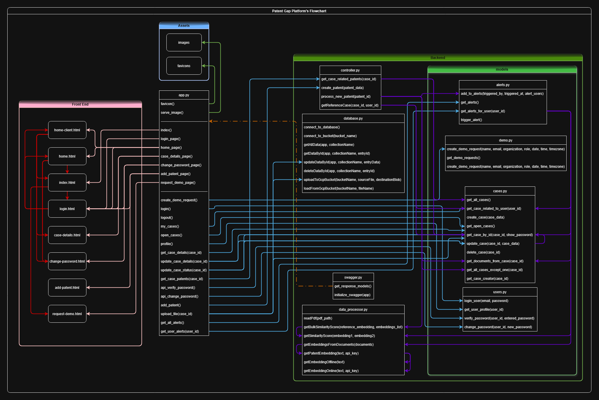

# Patent Gap - Flask Backend with HTML Frontend

A Flask-based web application for patent management with a modern HTML frontend.

> **ℹ️ For a non-technical, client-facing description of the platform, please see our [User Guide](./USER_GUIDE.md).**

## 📖 Document Navigation

This README uses emoji badges to help you quickly identify different types of content:

- **👥 For Users** - User-facing features, guides, and credentials
- **🔧 Setup & Configuration** - Installation, setup, and running instructions
- **⚙️ Technical/Developer** - Technical documentation, architecture, API details, and development notes
- **🚀 Future Enhancements** - Planned features and improvements

**Additional Documentation**:
- [Technical Requirements](./TechnicalRequirements.md) - GCP infrastructure requirements and specifications for hosting the platform
- [Technical Description for Non-Technical Staff](./TechnicalDescriptionForNonTechnicalStaff.md) - Business-friendly overview of platform capabilities and technology
- [File Structure](https://www.canva.com/design/DAG7NqrHH4I/mImb7-j9Tfcqoo2XLsXlOg/edit?utm_content=DAG7NqrHH4I&utm_campaign=designshare&utm_medium=link2&utm_source=sharebutton) - Whiteboard to Update File Structure
- [Flow Chart](https://www.canva.com/design/DAG6v9AHArY/QAgxnI7wmwHy38iH8UGifw/edit?utm_content=DAG6v9AHArY&utm_campaign=designshare&utm_medium=link2&utm_source=sharebutton) - Whiteboard to Update Flow Chart

---

## ⚙️ Project Structure

```
patent-gap/
├── Backend/                 # Python backend files
│   ├── app.py              # Main Flask application
│   ├── controller.py       # Business logic controllers
│   ├── data_processor.py  # PDF processing and text embedding functions
│   ├── database.py         # Database and cloud storage connectivity (Firebase, GCP)
│   ├── swagger.py          # Swagger/OpenAPI configuration
│   ├── env_controller.py   # Environment variable management
│   ├── file_controller.py  # File handling and operations
│   ├── llm_processor.py    # LLM processing functions
│   ├── favicon.ico         # Backend favicon
│   ├── env_example.txt     # Environment variables example
│   ├── run.spec            # PyInstaller specification file
│   ├── models/             # Data models organized by domain
│   │   ├── alerts.py       # Alert management models
│   │   ├── cases.py        # Case management models
│   │   ├── demo.py         # Demo request models
│   │   └── users.py        # User management models
│   ├── sources/            # External data source integrations
│   │   └── USPTO.py        # USPTO patent data source
│   ├── documentFiles/      # Document storage directory
│   ├── build/              # Build artifacts (PyInstaller)
│   └── dist/               # Distribution files (executables)
├── Frontend/               # HTML frontend files
│   ├── index.html          # Home page
│   ├── login.html          # Login page
│   ├── home.html           # Attorney dashboard page
│   ├── home-client.html    # Client dashboard page
│   ├── case-details.html   # Case details page
│   ├── add-patent.html     # Add new patent page
│   ├── request-demo.html   # Request demo page
│   ├── change_password.html # Change password page
│   └── styles.css          # Shared CSS styles
├── Assets/                 # Images, media, documents
│   ├── favicon-black.ico
│   ├── favicon-white.ico
│   ├── logo.png
│   ├── logo-black-nobg.png
│   ├── logo-white-nobg.png
│   ├── full_logo.png
│   ├── full_logo_transparent_green.png
│   ├── flowchart.png
│   ├── Function_Flowchart.png
│   ├── Platform-Flow.png
│   └── *.drawio            # Draw.io diagram files
├── Screenshots/            # Application screenshots
├── logs/                   # Application logs
│   └── serverLog.txt       # Server log file
├── build/                  # Build artifacts (PyInstaller)
├── dist/                   # Distribution files (executables)
├── venv/                   # Python virtual environment
├── dummyDataUspto.json     # Dummy USPTO data for testing
├── requirements.txt        # Python dependencies
├── install.sh              # Installation script (Linux/macOS)
├── LICENSE                 # License file
├── README.md               # This file
├── USER_GUIDE.md           # User-facing documentation
├── TechnicalRequirements.md # Technical requirements documentation
├── TechnicalDescriptionForNonTechnicalStaff.md # Non-technical overview
├── TODO.md                 # Development tasks and future enhancements
├── COST_ESTIMATE.md        # Cost estimation documentation
├── INVESTOR_REPORT.md      # Investor report
└── PRESENTATION_SCRIPT.md  # Presentation script
```

## 👥 Flowcharts




## 👥 Features

- **Home Page**: Landing page with three feature cards showcasing the platform's capabilities
- **Login System**: Secure authentication with session management
- **Dual Dashboard System**: 
  - **Attorney Dashboard**: Full case management with statistics and navigation
  - **Client Dashboard**: Simplified view with Active/Closed Patents sections
- **Case Management**: View and manage user's assigned cases with status tracking
- **Patent Management**: 
  - **Add New Patents**: Comprehensive form with file upload capabilities
  - **Patent Tracking**: Monitor active and closed patents
  - **Document Upload**: PDF file upload with drag-and-drop functionality
- **Case Details**: Detailed view of individual cases with related patent information
- **Profile Management**: User profile with case statistics and password management
- **Alert & Notification System**: 
  - Real-time alert notifications for similar patent cases
  - Alert popup panel with case details and similarity scores
  - Navigate directly to related cases from notifications
  - User-specific alerts based on case relationships
- **Demo Requests**: Request personalized demonstrations with scheduling
- **User Roles**: Support for both 'client' and 'attorney' user roles
- **API Documentation**: Interactive Swagger UI for comprehensive API testing and exploration

## 🔧 Setup Instructions

### Quick Installation (Recommended)

The installation scripts will automatically set up a virtual environment, install dependencies, create necessary directories, and generate run scripts.

#### For Linux/macOS:
```bash
# Make the script executable
chmod +x install.sh

# Run the installation script
./install.sh
```

#### For Windows:
```cmd
# Run the batch installation script
install.bat
```

#### For Windows PowerShell:
```powershell
# Set execution policy (if needed)
Set-ExecutionPolicy -ExecutionPolicy RemoteSigned -Scope CurrentUser

# Run the PowerShell installation script
.\install.ps1
```

#### What the Installation Scripts Do:
- ✅ Check Python 3.7+ installation
- ✅ Create virtual environment (`venv/`)
- ✅ Install all dependencies from `requirements.txt`
- ✅ Create necessary directories (`Assets/`, `Backend/logs/`, etc.)
- ✅ Generate `.env` file from template
- ✅ Create convenient run scripts (`run.sh`, `run-dev.sh`, `stop.sh`)
- ✅ Set up proper file permissions

### Manual Installation

If you prefer to set up the environment manually or the installation scripts don't work for your system:

#### 1. Create Virtual Environment

```bash
# Create virtual environment
python3 -m venv venv

# Activate virtual environment
# On Linux/macOS:
source venv/bin/activate
# On Windows:
venv\Scripts\activate
```

#### 2. Install Dependencies

```bash
# Upgrade pip
pip install --upgrade pip

# Install required packages
pip install -r requirements.txt
```

**Dependencies included:**
- `Flask==2.3.3` - Web framework
- `Flask-CORS==4.0.0` - Cross-origin resource sharing
- `python-dotenv==1.0.0` - Environment variable management
- `flasgger==0.9.7.1` - Swagger UI integration for API documentation
- `psycopg2-binary==2.9.7` - PostgreSQL database adapter
- `pymongo==4.5.0` - MongoDB database driver (primary database)
- `firebase-admin==6.4.0` - Firebase Admin SDK (optional, for cloud services)
- `PyPDF2==3.0.1` - PDF file processing
- `openai>=1.0.0` - OpenAI API for text embeddings (optional, requires API key)
- `google-generativeai>=0.3.0` - Google Gemini API for LLM report generation (optional)
- `numpy>=1.24.0` - Numerical computing library
- `scikit-learn>=1.3.0` - Machine learning library for TF-IDF embeddings
- `requests>=2.31.0` - HTTP library for API calls

#### 3. Environment Configuration

Copy the environment example file and configure your settings:

```bash
# Copy environment template
cp Backend/env_example.txt Backend/.env

# Edit the .env file with your preferred settings
```

**Required Environment Variables:**
```bash
# Flask Configuration
SECRET_KEY=your-secret-key-change-this-in-production
PORT=5000
DEBUG=True

# Environment (prod, dev, or test)
ENVIRONMENT=dev

# MongoDB Connection Strings (required)
DATABASE_CONNECTION_STRING_DEV=mongodb://localhost:27017/patent-gap
DATABASE_CONNECTION_STRING_PROD=mongodb://your-prod-connection-string
DATABASE_CONNECTION_STRING_TEST=mongodb://localhost:27017/patent-gap-test

# Collection Names
CASE_DATABASE_NAME_DEV=cases
CASE_DATABASE_NAME_PROD=cases
ALERT_DATABASE_NAME_DEV=alerts
ALERT_DATABASE_NAME_PROD=alerts
DEMO_DATABASE_NAME_DEV=demo_requests
USERS_DATABASE_NAME_DEV=users
```

**Optional API Keys:**
```bash
# USPTO API (for patent data fetching)
USPTO_API_KEY=your-uspto-api-key

# Google Gemini API (for LLM report generation - preferred)
GEMINI_API_KEY=your-gemini-api-key

# OpenAI API (alternative for embeddings/LLM)
OPENAI_API_KEY=sk-your-key-here

# Google Cloud Storage (for document storage)
GOOGLE_APPLICATION_CREDENTIALS=path/to/gcp-service-account.json
```

#### MongoDB Setup (Required)

The application uses MongoDB as its primary database:

1. **Install MongoDB** locally or use [MongoDB Atlas](https://www.mongodb.com/atlas)
2. **Configure connection string** in your `.env` file
3. **Collections are created automatically** on first run:
   - `cases` - Patent cases
   - `alerts` - User alerts
   - `demo_requests` - Demo request submissions
   - `users` - User accounts
   - `patents` - Patent records

#### USPTO API Setup (Recommended)

For fetching patent data from the US Patent and Trademark Office:

1. **Register for an API key** at [USPTO API Portal](https://account.uspto.gov/api-manager/)
2. **Configure environment variable**:
   ```bash
   USPTO_API_KEY=your-uspto-api-key
   ```

#### Google Gemini API Setup (Optional - For LLM Reports)

For generating AI-powered patent comparison reports:

1. **Get an API key** at [Google AI Studio](https://makersuite.google.com/app/apikey)
2. **Configure environment variable**:
   ```bash
   GEMINI_API_KEY=your-gemini-api-key
   ```
3. **Supported models**: `gemini-2.5-flash` (default)

#### OpenAI API Setup (Optional - Alternative LLM/Embeddings)

As an alternative to Gemini for embeddings and LLM:

1. **Create an OpenAI account** at [OpenAI Platform](https://platform.openai.com/)
2. **Generate an API key** from [API Keys](https://platform.openai.com/api-keys)
3. **Configure environment variable**:
   ```bash
   OPENAI_API_KEY=sk-your-key-here
   ```
4. **Supported models**: `gpt-4o-mini` for LLM, `text-embedding-3-small` for embeddings
5. **Note**: Without an API key, the system uses offline TF-IDF embedding method (`getEmbeddingOffline`) for patent analysis.

#### 4. Create Necessary Directories

```bash
# Create required directories
mkdir -p Assets
mkdir -p Backend/logs
mkdir -p Frontend/assets
mkdir -p Frontend/css
mkdir -p Frontend/js
```

#### 5. Run the Backend Application

```bash
# Navigate to Backend directory
cd Backend

# Run the Flask application
python app.py
```

**Important Notes:**
- The Flask app must be run from the `Backend/` directory
- Make sure the virtual environment is activated before running
- The application will be available at `http://localhost:5000`
- Press `Ctrl+C` to stop the server

### 🔧 Running the Application

#### Using Generated Scripts (After Installation)

After running the installation script, you can use the convenient run scripts:

- **Production mode**: `./run.sh` (Linux/macOS) or `run.bat` (Windows)
- **Development mode**: `./run-dev.sh` (Linux/macOS) or `run-dev.bat` (Windows)
- **PowerShell mode**: `.\run.ps1` (Windows PowerShell)
- **Stop application**: `./stop.sh` (Linux/macOS) or `stop.bat` (Windows)

#### Manual Backend Execution

If you prefer to run the backend manually or need to debug:

```bash
# 1. Activate virtual environment
source venv/bin/activate  # Linux/macOS
# OR
venv\Scripts\activate     # Windows

# 2. Navigate to Backend directory
cd Backend

# 3. Run the Flask application
python app.py
```

**Backend Server Details:**
- **Default URL**: `http://localhost:5000`
- **Host**: `0.0.0.0` (accessible from other devices on network)
- **Port**: `5000` (configurable via `.env` file)
- **Debug Mode**: Enabled by default in development
- **Auto-reload**: Enabled when `FLASK_DEBUG=1`

**Troubleshooting:**
- If port 5000 is busy, change `PORT` in `Backend/.env`
- Make sure you're in the `Backend/` directory when running `python app.py`
- Check that the virtual environment is activated
- Verify all dependencies are installed: `pip list`

### ⚙️ Testing Swagger Documentation

To verify that Swagger is properly set up and working:

1. **Start the backend server** (if not already running):
   ```bash
   cd Backend
   python app.py
   ```

2. **Open your browser** and navigate to:
   - **Swagger UI**: `http://localhost:5000/swagger/`
   - **OpenAPI JSON**: `http://localhost:5000/apispec.json`

3. **Verify functionality**:
   - Swagger UI should load with all API endpoints visible
   - You should see 9 API endpoints organized by categories
   - Each endpoint should have detailed documentation with examples
   - You can test endpoints directly from the interface

## 👥 Demo Credentials

For testing purposes, use these credentials:
- **Email**: admin@example.com
- **Password**: password123

## ⚙️ API Documentation

### Swagger UI Interface

The application includes comprehensive API documentation powered by Swagger UI. This provides an interactive interface to explore and test all API endpoints.

#### Accessing Swagger Documentation

Once the backend is running, you can access the API documentation at:

- **Swagger UI**: `http://localhost:5000/swagger/`
- **OpenAPI JSON Spec**: `http://localhost:5000/apispec.json`

#### Features of Swagger Documentation

- **Interactive API Testing**: Test endpoints directly from the browser
- **Request/Response Examples**: See example data for all endpoints
- **Authentication Support**: Test authenticated endpoints with session management
- **Schema Validation**: View detailed request/response schemas
- **Organized by Categories**: Endpoints grouped by functionality (Authentication, Cases, Profile, Patents)

#### Using Swagger UI

1. **Navigate to the Swagger UI**: Open `http://localhost:5000/swagger/` in your browser
2. **Explore Endpoints**: Click on any endpoint to expand its details
3. **Test Endpoints**: Click "Try it out" to test endpoints with real data
4. **View Schemas**: Check the "Models" section to see data structures
5. **Authentication**: Some endpoints require login - use the `/api/login` endpoint first

### API Endpoints

#### Authentication
- `POST /api/login` - User login with email and password
- `POST /api/logout` - User logout and session clearing

#### Cases Management
- `GET /api/my-cases` - Get user's assigned cases (created_by, assigned_to, or accepted_by)
- `GET /api/open-cases` - Get available cases for assignment (non-completed cases)
- `GET /api/cases/<case_id>` - Get detailed information about a specific case
- `POST /api/cases/<case_id>` - Update case details
- `POST /api/cases/<case_id>/update-status` - Update case information (status, priority, etc.)

#### Profile Management
- `GET /api/profile` - Get user profile and statistics
- `POST /api/verify-password` - Verify current password
- `POST /api/change-password` - Change user password

#### Patent Management
- `GET /api/cases/<case_id>/patents` - Get related patents for a specific case (keyword-based similarity)
- `POST /api/add-patent` - Add a new patent manually
- `POST /api/create-patent` - Create a new patent with user attribution
- `POST /api/import-patent-from-uspto` - Import patent data from USPTO by patent ID
- `POST /api/fetch-patent-from-uspto` - Fetch and create a case from USPTO patent data

#### File Management
- `POST /api/upload-file-to-local-storage/<case_id>` - Upload file to local `documentFiles/` directory
- `POST /api/upload-file/<case_id>` - Upload file to Google Cloud Storage bucket

#### Alert & Notification Management
- `GET /api/alerts` - Get all alerts in the system
- `GET /api/alerts/` - Get alerts for the current user with similarity analysis

#### Similarity Analysis
- `POST /api/trigger-similarity-analysis` - Trigger keyword-based similarity analysis for a case
- `GET /api/case-keywords` - Extract keywords from a document URL or title/description

#### Demo Requests
- `POST /api/create-demo-request` - Create a new demo request

#### Web Pages
- `GET /` - Home page (landing page, initializes database collections)
- `GET /login` - Login page
- `GET /home` - Client/Attorney dashboard page (requires authentication)
- `GET /case-details?id=<case_id>` - Case details page (requires authentication)
- `GET /add-patent` - Add new patent page (requires authentication)
- `GET /request-demo` - Request demo page
- `GET /change-password` - Change password page (requires authentication)
- `GET /favicon.ico` - Serve favicon from Assets directory
- `GET /images/<path:imageName>` - Serve images from Assets directory

## ⚙️ Data Processing Module

The `data_processor.py` module provides functionality for processing patent documents, generating text embeddings, and performing similarity analysis.

### Keyword Extraction Functions

#### `getKeywordsFromContent(content, api_key=None, model="gpt-3.5-turbo")`
Extracts keywords from text content using online (OpenAI) or offline (TF-IDF) methods.

- **Parameters**: 
  - `content` (str) - Text to extract keywords from
  - `api_key` (str, optional) - OpenAI API key for online extraction
  - `model` (str) - OpenAI model to use (default: gpt-3.5-turbo)
- **Returns**: List of keyword strings
- **Fallback**: Uses TF-IDF if no API key provided or API fails

#### `getKeywordsFromPatent(documents)`
Extracts keywords from patent documents by reading their content.

- **Parameters**: `documents` (list) - List of document dictionaries with `url` keys
- **Returns**: List of keywords extracted from all documents

#### `extract_keywords_from_documents(document_urls, top_n=15)`
Reads content from document URLs and extracts keywords using TF-IDF.

- **Parameters**: 
  - `document_urls` (list) - List of URLs/paths to documents
  - `top_n` (int) - Number of top keywords per document (default: 15)
- **Returns**: dict - Mapping of document URLs to keyword lists

### Embedding Functions

#### `getEmbeddingOnline(text, api_key=None, model="text-embedding-3-small")`
Generates semantic embeddings using OpenAI's embedding API.

- **Parameters**: 
  - `text` (str) - Text to embed
  - `api_key` (str, optional) - OpenAI API key
  - `model` (str) - OpenAI model (default: text-embedding-3-small)
- **Returns**: List of floats (1536-dimensional vector)
- **Requirements**: OpenAI API key

#### `getEmbeddingOffline(text)`
Generates TF-IDF embeddings for offline text similarity analysis.

- **Parameters**: `text` (str) - Text to embed
- **Returns**: numpy.ndarray - TF-IDF feature vector
- **Libraries**: scikit-learn, numpy
- **Requirements**: No API key needed (works offline)

#### `getPatentEmbedding(text, api_key=None)`
Main embedding function with automatic fallback to offline TF-IDF.

- **Parameters**: 
  - `text` (str) - Text to embed
  - `api_key` (str, optional) - OpenAI API key
- **Returns**: List of floats or numpy array
- **Fallback**: Uses `getEmbeddingOffline` if no API key or API fails

#### `getEmbeddingsFromDocuments(documents)`
Extracts embeddings from multiple documents using `readDocumentFromUrl`.

- **Parameters**: `documents` (list) - List of document paths/URLs
- **Returns**: List of embeddings (combined from all documents)

### Similarity Functions

#### `getSimilarityScore(embedding1, embedding2)`
Calculates cosine similarity between two embedding vectors.

- **Parameters**: 
  - `embedding1` - First embedding vector
  - `embedding2` - Second embedding vector
- **Returns**: float - Similarity score (0 to 1, or -1 on error)
- **Libraries**: numpy
- **Note**: Validates embedding dimensions and handles NaN values

#### `getBulkSimilarityScore(reference_embedding, embeddings_list)`
Calculates similarity scores between a reference and multiple embeddings.

- **Parameters**: 
  - `reference_embedding` - Reference embedding vector
  - `embeddings_list` - List of embedding vectors to compare
- **Returns**: List of float similarity scores

### USPTO Integration Functions

#### `initialize_uspto_api()` / `get_uspto_api()`
Initialize and retrieve the USPTO Patent API client instance.

- **Returns**: USPTOPatentAPI instance
- **Requirements**: `USPTO_API_KEY` environment variable

#### `getKeywordDocumentsUSPTO(keywords, load_to_database=False)`
Retrieves patent documents from USPTO matching specified keywords.

- **Parameters**: 
  - `keywords` (list) - Keywords to search for
  - `load_to_database` (bool) - Whether to save results to database
- **Returns**: List of normalized patent records with documents, embeddings, and references

#### `isolateDataFromUSPTOResults(result)`
Extracts and normalizes key data from raw USPTO API results.

- **Parameters**: `result` (dict) - Raw USPTO API result
- **Returns**: Normalized case dictionary with `_id`, `title`, `status`, `attorneys`, `inventors`, etc.

### Reference & Report Functions

#### `getReferenceFromNormalizedList(listOfCases, case_id)`
Compiles reference list with similarity scores from normalized cases.

- **Parameters**: 
  - `listOfCases` (list) - List of normalized case dictionaries
  - `case_id` (str) - ID of the case to compare against
- **Returns**: List of reference dictionaries with URL, title, date, and similarity rate

#### `generateReports(case_id)`
Generates full and summary reports for a case using LLM.

- **Parameters**: `case_id` (str) - Case identifier
- **Returns**: Tuple of (fullReport, summaryReport) strings

#### `populateDummyData(case_id, user_id)`
Creates dummy case data for testing when USPTO rate limits are hit.

- **Parameters**: 
  - `case_id` (str) - Case identifier
  - `user_id` (str) - User identifier
- **Returns**: Dummy case dictionary

### Use Cases

1. **Keyword Extraction**: Extract domain-specific keywords from patent documents
2. **USPTO Integration**: Search and import patents from USPTO database
3. **Embedding Generation**: Create embeddings for semantic similarity (online/offline)
4. **Similarity Analysis**: Compare patent documents using cosine similarity
5. **Reference Generation**: Build reference lists with similarity scores
6. **Report Generation**: Create AI-powered comparison reports

## ⚙️ LLM Processor Module

The `llm_processor.py` module provides AI-powered report generation using Google Gemini or OpenAI.

### Available Functions

##### `getDefaultModelName()`
Returns the default model name based on available API keys (Gemini > OpenAI).

- **Returns**: `'gemini-2.5-flash'`, `'gpt-4o-mini'`, or `None`

##### `getModelClient(model_name='gemini-2.5-flash')`
Gets the appropriate LLM client based on model name.

- **Parameters**: `model_name` (str) - Model name (`gemini-*` or `gpt-*`)
- **Returns**: Model client instance or None
- **Supported Models**: `gemini-2.5-flash`, `gpt-4o-mini`

##### `llm_health_check(model_name='gemini-2.5-flash')`
Tests if the LLM service is available and responding.

- **Returns**: bool - True if healthy

##### `getIndividualReport(reference_text, document_text, model_name)`
Generates a comparison report between two documents.

- **Parameters**: 
  - `reference_text` (str): Reference document text
  - `document_text` (str): Document to compare
  - `model_name` (str): LLM model to use
- **Returns**: Comparison report (250 words or fewer)

##### `getIndividualTitle(reference_text, document_text, model_name)`
Generates a title for a document comparison.

- **Parameters**: Same as `getIndividualReport`
- **Returns**: Title string (10 words or fewer)

##### `getCompleteReport(reference_text, documents, model_name)`
Generates a complete report comparing multiple documents to a reference.

- **Parameters**: 
  - `reference_text` (str): Reference document text
  - `documents` (list): List of document texts to compare
  - `model_name` (str): LLM model to use
- **Returns**: Markdown-formatted complete report

##### `getReportSummary(report, model_name)`
Generates a summary of a report.

- **Parameters**: 
  - `report` (str): Report text to summarize
  - `model_name` (str): LLM model to use
- **Returns**: Summary string (100 words or fewer)

##### `getDummyReportWithSummary(title, model_name)`
Generates dummy report data for testing/fallback scenarios.

- **Parameters**: 
  - `title` (str): Patent title
  - `model_name` (str): LLM model to use
- **Returns**: Tuple of (report, summary)

## ⚙️ File Controller Module

The `file_controller.py` module provides document reading and conversion functions.

### Available Functions

##### `xml_to_text(xml_content)`
Converts XML content to plain text.

- **Parameters**: `xml_content` (str or bytes): XML content
- **Returns**: Extracted text string

##### `readFromXmlUrl(xml_url, headers=None, params=None)`
Downloads and returns XML content from a URL.

- **Parameters**: 
  - `xml_url` (str): URL of the XML file
  - `headers` (dict, optional): HTTP headers
  - `params` (dict, optional): Query parameters
- **Returns**: Raw XML content as text

##### `readFromPdfUrl(pdf_url, headers=None, params=None)`
Downloads a PDF from URL and extracts text content.

- **Parameters**: 
  - `pdf_url` (str): URL of the PDF file
  - `headers` (dict, optional): HTTP headers
  - `params` (dict, optional): Query parameters
- **Returns**: Extracted text from PDF

##### `readDocumentFromUrl(url, headers=None, params=None)`
Reads any document from URL based on file extension (.xml or .pdf).

- **Parameters**: 
  - `url` (str): Document URL
  - `headers` (dict, optional): HTTP headers (e.g., API keys)
  - `params` (dict, optional): Query parameters
- **Returns**: Extracted text content

**Example:**
```python
from file_controller import readDocumentFromUrl
text = readDocumentFromUrl('https://example.com/patent.pdf', headers={"X-API-KEY": "key"})
```

## ⚙️ Architecture Overview

The backend follows a modular architecture with clear separation of concerns:

### Models (`Backend/models/`)
Domain-specific data models organized by entity:
- **`alerts.py`**: Alert creation, retrieval, user-specific alert filtering with similarity analysis
- **`cases.py`**: Case CRUD operations, user-case relationships, document handling, embedding retrieval
- **`demo.py`**: Demo request creation and management
- **`users.py`**: User authentication (mock data), profile management, password operations

### Database Module (`Backend/database.py`)
Provides connectivity and operations for:
- **MongoDB Database**: Primary database for all collections (cases, alerts, users, demo_requests, patents)
- **Google Cloud Storage**: File upload/download operations for document storage
- Environment-aware connection management (dev/prod/test)
- Auto-creation of collections on first access

### Controller (`Backend/controller.py`)
Business logic layer that orchestrates:
- Patent creation and processing with keyword-based similarity matching
- New patent processing workflow with embedding extraction and alert generation
- Case-related patent retrieval using keyword matching
- Coordinates between models, data processing, and external APIs

### Data Processor (`Backend/data_processor.py`)
Text processing, embedding generation, and USPTO integration:
- Keyword extraction (online via OpenAI or offline via TF-IDF)
- OpenAI embeddings (online) or TF-IDF embeddings (offline fallback)
- Cosine similarity calculations for patent analysis
- USPTO API integration for patent search and data normalization
- Report generation coordination with LLM processor

### LLM Processor (`Backend/llm_processor.py`)
AI-powered content generation:
- Multi-model support (Google Gemini, OpenAI GPT)
- Patent comparison report generation
- Report summarization
- Automatic model selection based on available API keys

### File Controller (`Backend/file_controller.py`)
Document reading and conversion:
- XML to text conversion
- PDF text extraction from URLs
- Multi-format document handling with HTTP header support

### Sources (`Backend/sources/`)
External data source integrations:
- **`USPTO.py`**: Comprehensive USPTO Patent API wrapper for patent search, document retrieval, and data normalization

### Environment Controller (`Backend/env_controller.py`)
Configuration management:
- API key retrieval (USPTO, OpenAI, Gemini)
- Environment-aware database connection strings
- Collection name management for different environments

## ⚙️ Database Module

The `database.py` module provides MongoDB database connectivity and Google Cloud Storage operations.

### MongoDB Operations

##### `connect_to_database()`
Connects to MongoDB using connection string from environment variables.

- **Returns**: MongoDB database instance (`patent-gap` database)
- **Required Environment Variables**: `DATABASE_CONNECTION_STRING_DEV`, `DATABASE_CONNECTION_STRING_PROD`, or `DATABASE_CONNECTION_STRING_TEST` (based on `ENVIRONMENT` setting)

**Example:**
```python
from database import connect_to_database
db = connect_to_database()
```

##### `getCollectionsFromDatabase(db)`
Fetches all collection names from the database.

- **Parameters**: `db` - MongoDB database instance
- **Returns**: list - List of collection names

##### `checkCollectionExists(db, collectionName)`
Checks if a collection exists in the database.

- **Parameters**: 
  - `db` - MongoDB database instance
  - `collectionName` (str): Collection name to check
- **Returns**: bool - True if exists

##### `createCollection(db, collectionName)`
Creates a new collection in the database.

- **Parameters**: 
  - `db` - MongoDB database instance
  - `collectionName` (str): Collection name to create
- **Returns**: Collection instance or None if failed

##### `getAllData(db, collectionName)`
Fetches all documents from a MongoDB collection.

- **Parameters**: 
  - `db` - MongoDB database instance
  - `collectionName` (str): Collection name
- **Returns**: list - List of all documents with `_id` converted to string

**Example:**
```python
from database import connect_to_database, getAllData
db = connect_to_database()
all_cases = getAllData(db, 'cases')
```

##### `getDataById(db, collectionName, entryId)`
Fetches a specific document by ID from a collection.

- **Parameters**: 
  - `db` - MongoDB database instance
  - `collectionName` (str): Collection name
  - `entryId` (str): Document ID to retrieve
- **Returns**: dict - Document data, or None if not found

##### `addDataById(db, collectionName, entryData)`
Adds a new document to a collection. Auto-generates `_id` if not provided.

- **Parameters**: 
  - `db` - MongoDB database instance
  - `collectionName` (str): Collection name
  - `entryData` (dict): Document data to insert
- **Returns**: str - Inserted document ID

##### `updateDataById(db, collectionName, entryData)`
Updates a specific document by its `_id` field.

- **Parameters**: 
  - `db` - MongoDB database instance
  - `collectionName` (str): Collection name
  - `entryData` (dict): Data to update (must include `_id`)
- **Returns**: bool - True if successful

##### `deleteDataById(db, collectionName, entryId)`
Deletes a specific document by ID.

- **Parameters**: 
  - `db` - MongoDB database instance
  - `collectionName` (str): Collection name
  - `entryId` (str): Document ID to delete
- **Returns**: bool - True if successful

##### `insertOrUpdateDataById(db, collectionName, entryData)`
Upsert operation - inserts if not exists, updates if exists.

- **Parameters**: 
  - `db` - MongoDB database instance
  - `collectionName` (str): Collection name
  - `entryData` (dict): Document data (must include `_id`)
- **Returns**: str - Document ID

##### `deleteAllData(db, collectionName)`
Deletes all documents from a collection.

- **Parameters**: 
  - `db` - MongoDB database instance
  - `collectionName` (str): Collection name
- **Returns**: DeleteResult object

### Google Cloud Storage Operations

##### `connect_to_bucket(bucketName)`
Connects to a Google Cloud Storage bucket.

- **Parameters**: `bucketName` (str) - GCP bucket name
- **Returns**: Bucket instance
- **Requirements**: `GOOGLE_APPLICATION_CREDENTIALS` environment variable

##### `uploadToGcpBucket(bucketName, sourceFile, destinationBlob)`
Uploads a file to GCP Storage.

- **Parameters**: 
  - `bucketName` (str): GCP bucket name
  - `sourceFile` (str): Local file path
  - `destinationBlob` (str): Destination path in bucket
- **Returns**: str - Bucket URL (`bucket-name/file-name`) or None if failed

##### `loadFromGcpBucket(bucketName, fileName)`
Loads a file from GCP Storage into memory.

- **Parameters**: 
  - `bucketName` (str): GCP bucket name
  - `fileName` (str): File path in bucket
- **Returns**: bytes - File content, or None if failed

## ⚙️ Development Notes

### Current Implementation Status

- **Database**: MongoDB is the primary database (not Firebase Realtime Database)
- **Authentication**: Flask sessions with mock user data in `models/users.py` (TODO: integrate with database)
- **Cases Module**: Fully integrated with MongoDB database
- **Alerts Module**: Fully integrated with MongoDB database
- **User Module**: Currently uses mock data (database integration pending)

### Technical Details

- **Flask Sessions**: Used for authentication state management
- **CORS**: Enabled for cross-origin requests
- **Modular Architecture**: Backend organized into models, controllers, processors, and sources
- **Environment-aware Configuration**: Separate settings for dev/prod/test environments
- **Auto-collection Creation**: Database collections created automatically on first access

### Frontend Implementation

- **Vanilla JavaScript**: API calls without framework dependencies
- **Responsive Design**: Works on desktop and mobile devices
- **URL Parameters**: Case details page uses `?id=<case_id>` format
- **Dual Dashboard System**: Separate interfaces for attorneys and clients
- **User Role Management**: Support for 'client' and 'attorney' roles

### Key Features

- **Patent Management**: CRUD operations with USPTO integration and local file upload
- **Keyword-based Similarity**: Patent matching using extracted keywords
- **Embedding-based Similarity**: Cosine similarity using TF-IDF or OpenAI embeddings
- **Alert & Notification System**: 
  - User-specific alerts with similarity analysis
  - Automatic alert generation on similarity analysis
  - Notification tracking with open/sent receipts
- **File Upload**: Local storage (`documentFiles/`) and GCP bucket support
- **LLM Reports**: AI-generated comparison reports using Gemini or OpenAI
- **USPTO Integration**: Patent search, document retrieval, and data import

### API Documentation

- **Swagger UI**: Comprehensive interactive documentation at `/swagger/`
- **OpenAPI 2.0**: Full specification with schemas and examples

## 🚀 Future Enhancements

For a comprehensive list of planned features, bugs to resolve, and research items, please see [`TODO.md`](./TODO.md).

### Upcoming Features
- **AI Model**: AI chatbot for user interactions with case embeddings
- **Firebase Integration**: Complete Firebase notification connections and alert initiation
- **Document Separation**: Separate technical documents from case files for better similarity matching
- **Enhanced Styling**: Improved UI/UX with unique design elements
- **Additional Sources**: More patent data sources from global and regional providers
- **Database Integration**: Full Firebase database connection with proper collections
- **Analytics Integration**: Firebase Analytics integration for usage tracking
- **Alert Handlers**: Frontend alert message handlers for better user experience

### Active Development Areas
- **Bug Fixes**: Resolving empty document embedding issues that trigger spam alerts
- **Research**: Patent sources, translation methods, and AI model selection for chatbot

For detailed information on all planned features, current bugs, and research items, see the [`TODO.md`](./TODO.md) file.
